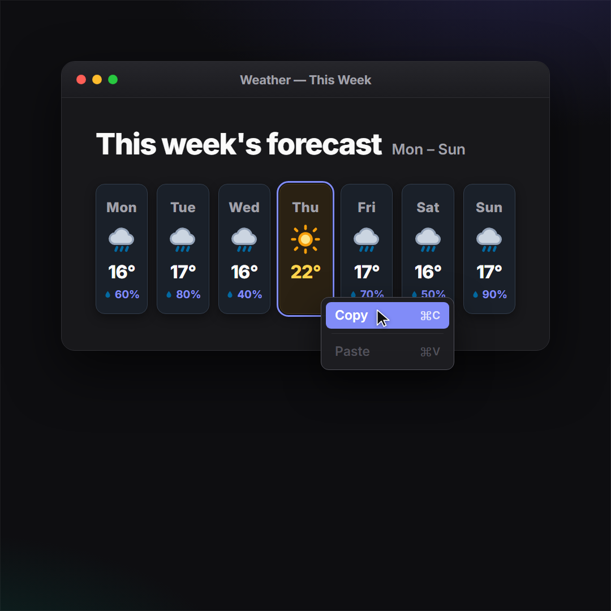

# LinkedIn Carousel Kit

Design **LinkedIn carousels** (swipeable document posts) as HTML, render them to crisp
**1080×1080 PNGs** with Playwright, and bundle a ready-to-upload **PDF** — all from the terminal,
no design tool required.

It ships as a [Claude Code](https://claude.com/claude-code) **skill** (drop it in `.claude/skills/`
and it activates on demand), but the `assets/` are plain files you can use by hand too.



## Features

- **Design system in one file** — `assets/slide.css`: tokens (colors, type, spacing, shadows) plus a
  component library (headlines, bullet lists, cards, chips, quotes, cover logo-strip).
- **App-mockup module** — macOS-style window, right-click context menu, and cursor for
  "I wish this app existed" jokes. See the worked **weather** example in [`example/`](example/).
- **One-command pipeline** — `render.mjs` (HTML → PNG) and `pdf.mjs` (PNG → square PDF).
- **`dom-mover.js`** — drag elements in the browser to position menus/cursors, then read back
  coordinates. It's auto-blocked from the export.

## Quick start

```bash
# 1. scaffold a post (copy the toolkit)
mkdir -p my-post/slides my-post/png
cp assets/{render.mjs,pdf.mjs,package.json} my-post/
cp assets/{slide.css,dom-mover.js} my-post/slides/
cp assets/slide-template.html my-post/slides/01-cover.html
cd my-post && npm install        # Playwright (Chromium cached after first run)

# 2. author slides in slides/*.html (see references/components.md)

# 3. render + bundle
node render.mjs                  # slides/*.html → png/*.png
node pdf.mjs                     # png/*.png → my-post-carousel.pdf
```

Upload the PDF on LinkedIn via **Start a post → Document**.

## Try the example

```bash
cd example/weather && npm install && npm run render && npm run pdf
```

## Structure

```
assets/            slide.css · render.mjs · pdf.mjs · dom-mover.js · package.json · slide-template.html
references/        components.md — tokens table + every component with example markup
example/weather/   a complete 3-slide carousel (the "copy a sunny day, paste the week" gag)
SKILL.md           Claude Code skill definition
```

## Retheme

Change `--accent` / `--accent-strong` / `--accent-soft` (and optionally the font `@import`) at the
top of your post's `slide.css` copy — every component follows. Put post-specific components at the
bottom of that file; the weather-week tiles are there as a pattern to adapt.

## License

MIT — see [LICENSE](LICENSE).
